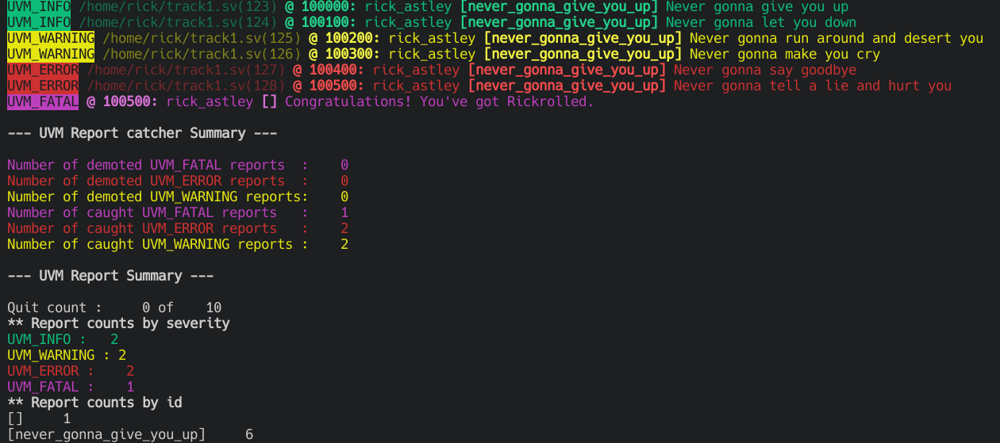
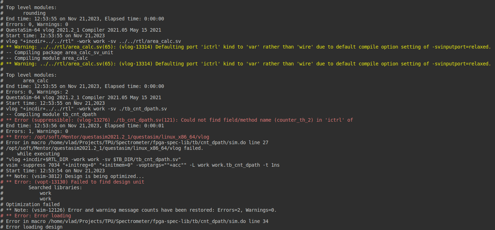

# EDA log colorizer

EDA logs usually are so flat, boring and deadly monochrome. This simple utility can colorize any log to make it easier to read.

Many thanks [iDoka](https://github.com/iDoka) for the [reference](http://idoka.ru/blog/posts/colorize-fpga-vivado-log/).

## Supported log formats

<details>
  <summary>UVM</summary>

  
</details>

<details>
  <summary>VCS</summary>

  
</details>

<details>
  <summary>VSIM</summary>

  
</details>

## Requirements

Any environment where `bash` and `sed` are available.

## Installation

Nothing special is needed, but you can create a symlink for more convenient use:

```bash
ln -sr ./log-colorizer ~/.local/bin/log-colorizer
```

## Usage

Generale use:

```bash
<sim log> | log-colorizer {uvm,vcs,vsim}
```

To colorize simulation output:

```bash
./run_your_sim | log-colorizer uvm
```

To colorize existing log file:

```bash
cat vcs.log | log-colorizer vcs
```
